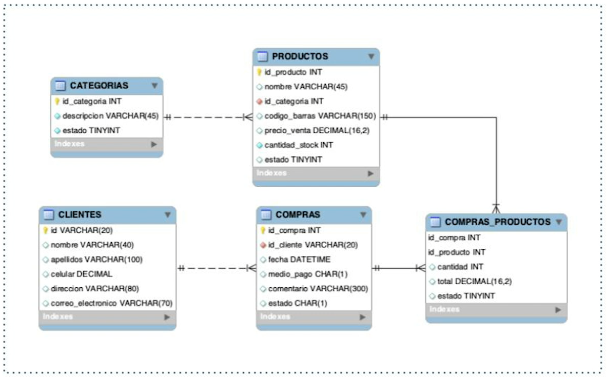
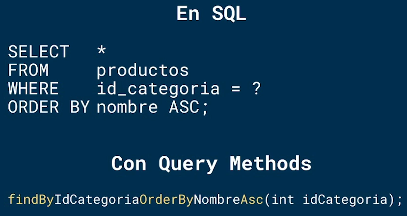
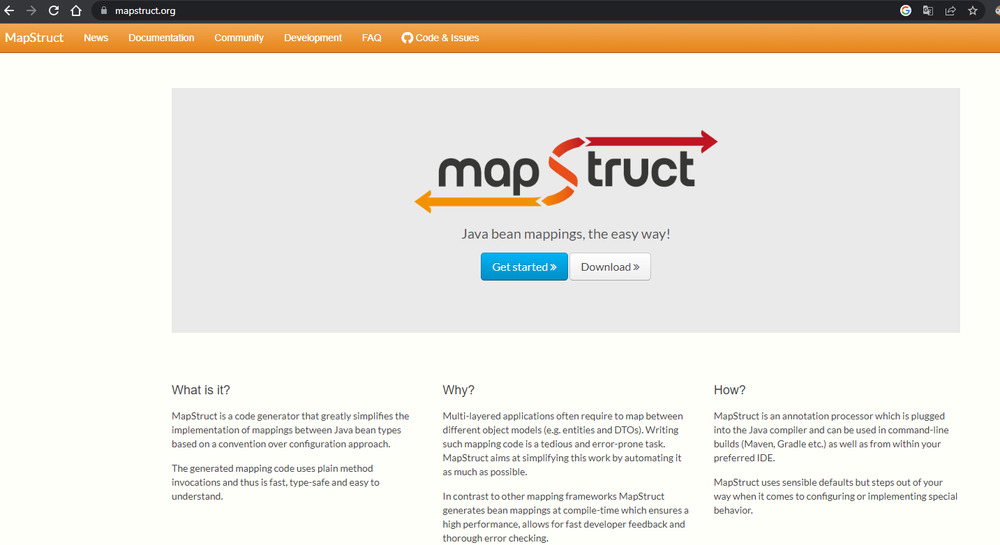
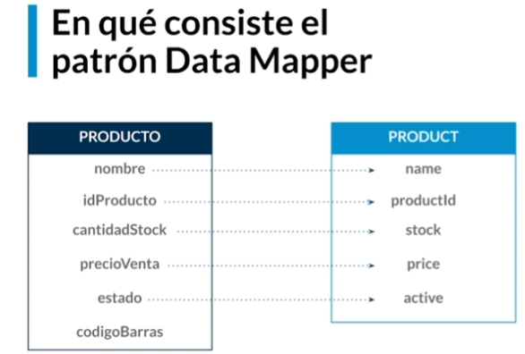

# java-spring-platzi
Curso completo de Spring Framework, Spring Boot, Spring Data JPA y Spring Security de Platzi

## DOCUMENTACION
Properties: https://docs.spring.io/spring-boot/docs/current/reference/html/application-properties.html

Perfiles: https://docs.spring.io/spring-boot/docs/current/reference/html/features.html#features.profiles

BigDecimal: https://dzone.com/articles/never-use-float-and-double-for-monetary-calculatio

MapStruct: https://mapstruct.org/documentation/installation/

